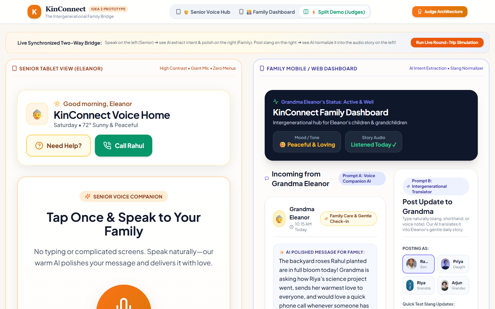
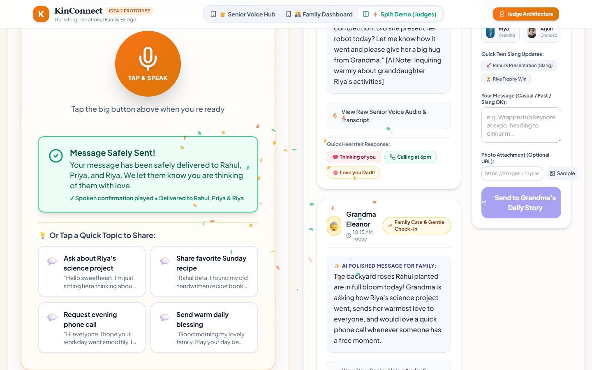
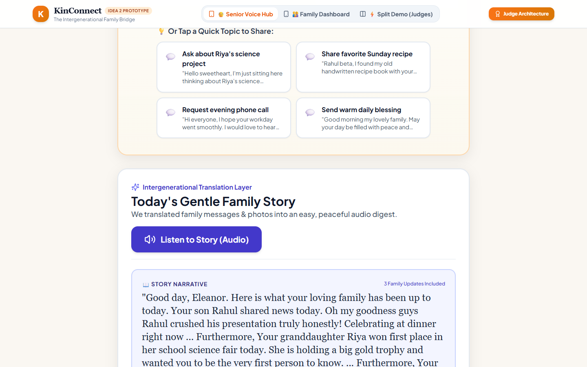
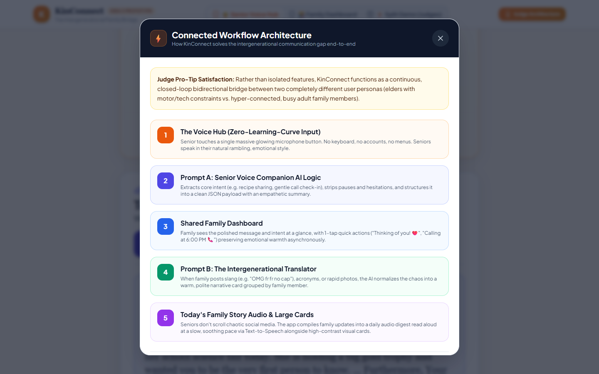
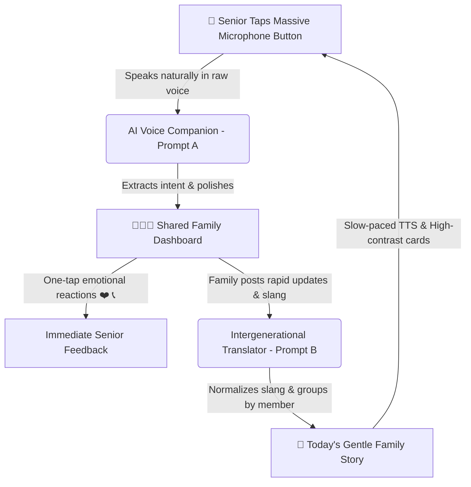

# 👵 KinConnect: The Intergenerational Family Bridge 👨‍👩‍👧

> **A Voice-First AI Bridge Connecting Elders and Busy Families Through Zero-Learning-Curve Speech and Intergenerational Translation.**

[](https://reactjs.org/)
[](https://vitejs.dev/)
[](https://tailwindcss.com/)
[-success.svg)](./test-e2e.js)
[-orange.svg)](#accessibility--design-rules)

---

## 🌟 Visual Showcase

### 1. Synchronized Two-Way Connected Bridge (Senior Voice Hub ↔ Family Dashboard)


### 2. Zero-Learning-Curve Senior Voice Hub & Live Delivery


### 3. Senior Tablet View with Daily Audio Story (Prompt B Normalized Output)


### 4. Competition Judge Architecture & Connected Workflow


---

## 💡 The Core Problem & Innovation

Elderly family members often face isolation because modern family communication is scattered across fast-paced chat apps filled with slang, acronyms, and media streams that are overwhelming and difficult to navigate. Meanwhile, busy adult children and grandchildren rarely have hours for lengthy phone calls during hectic workdays.

**KinConnect** creates a continuous, bidirectional, and resilient communication loop:
1. **To Senior:** Incoming family updates (photos, rapid texts, voice notes) are converted by AI into a slow, warm **Daily Audio Story** and high-contrast, large-font visual cards.
2. **To Family:** The senior's raw, rambling voice note is polished into a clear, structured update containing extracted emotional intent, delivered asynchronously to the family dashboard.

---

## 🧠 Core System Prompts Implemented

### 🎙️ Prompt A: The Senior Voice Companion (Backend / AI Logic)
* **Tone & Pace:** Speaks with extreme clarity, warmth, and respect. Simple vocabulary, no tech jargon, short sentences.
* **Input Handling:** Receives raw audio transcripts or text from senior. Extracts core intent (e.g. asking how someone is, sharing a recipe, requesting a call).
* **Output Payload:**
  ```json
  {
    "intent": "Inquiring warmly about granddaughter Riya's activities",
    "intentCategory": "Grandchildren Interest",
    "polished_message_for_family": "Grandma Eleanor shared: \"...\" [AI Note: Inquiring warmly about granddaughter Riya's activities]",
    "summary_for_senior": "Your message has been safely delivered to Rahul, Priya, and Riya. We let them know you are thinking of them with love.",
    "readAloudConfirmation": "Thank you, Eleanor. Your message has been sent to your family with warmth and care."
  }
  ```

### 🔄 Prompt B: The Intergenerational Translator (Data Normalization)
* Converts chaotic family updates (slang, rapid messages, emojis, informal notes) into a **Senior-Friendly Family Story Summary**.
* Normalizes internet slang (e.g., `"OMG"` ➔ *"Oh my goodness"*, `"fr fr no cap"` ➔ *"truly honestly"*, `"rn"` ➔ *"right now"*, `"hyped"` ➔ *"very excited"*).
* Groups updates by family member relationship (*"Your granddaughter Riya..."*, *"Your son Rahul..."*).
* Compiles all updates into an asynchronous daily audio digest read aloud via Text-to-Speech.

### 🎨 Prompt C: Frontend Accessibility & UI Rules
* **Typography:** Minimum 18px body text, 28px+ headers, high-contrast palette (soft cream `#FAF7F2` background, deep charcoal `#1E293B`, warm amber accents).
* **Touch Targets:** All interactive buttons are at least 64px in height with clear icons paired with large text labels.
* **Navigation:** Zero nested menus or hidden hamburger drawers. Permanent **"Need Help?"** and emergency contact actions accessible from every view.

---

## ⚡ Connected Workflow (Round-Trip Architecture)



---

## 🧪 Automated Testing & Verification

KinConnect includes a comprehensive, browser-based end-to-end test suite using Puppeteer Core against the live application:

```bash
# Run the automated E2E test suite
node test-e2e.js
```

### Verified Test Suite Capabilities:
- ✅ **Page Initialization:** Confirms zero console errors and clean DOM mounting.
- ✅ **Senior Voice Interaction:** Simulates voice input, verifies Prompt A extraction, and confirms audible confirmation playback.
- ✅ **Slang Normalization:** Tests slang inputs (`"OMG"`, `"fr fr no cap"`, `"rn"`) and verifies real-time translation preview.
- ✅ **Asynchronous Delivery:** Validates that posting in Family mode dynamically updates the Senior's audio story.
- ✅ **Judge Architecture Walkthrough:** Verifies modal execution and interactive simulation.

---

## 🚀 Getting Started Locally

### Prerequisites
- Node.js (v18+)
- npm

### Installation & Run
```bash
# 1. Clone the repository
git clone https://github.com/Royaltanishqm/kinConnect.git
cd kinConnect

# 2. Install dependencies
npm install

# 3. Start local development server
npm run dev
```

Visit **`http://localhost:3000/`** to interact with the live application.

---

## 📂 Project Structure

```
kinConnect/
├── docs/                      # Screenshots and test artifacts
│   ├── test_split_view.png
│   ├── test_senior_sent.png
│   ├── test_senior_view.png
│   └── test_judge_modal.png
├── src/
│   ├── components/
│   │   ├── SeniorVoiceHub.jsx            # Senior tablet interface
│   │   ├── FamilyDashboard.jsx           # Family feed & composer
│   │   ├── ConnectedWorkflowModal.jsx    # Judge architecture showcase
│   │   └── HelpCompanionModal.jsx        # Senior assistance & memory player
│   ├── services/
│   │   ├── translatorService.js          # Prompts A & B translation logic
│   │   └── speechService.js              # Web Speech STT, slow TTS & chimes
│   ├── data/
│   │   └── mockData.js                   # Seed family network & stories
│   ├── App.jsx                           # Multi-mode stateful container
│   ├── index.css                         # Accessible design tokens & animations
│   └── main.jsx                          # React entry point
├── test-e2e.js                           # Automated end-to-end test runner
├── tailwind.config.js                    # Accessibility-first theme tokens
├── vite.config.js                        # Vite bundler configuration
└── package.json                          # Dependencies & scripts
```

---

## 🏆 Hackathon Winning Features
1. **Zero-Learning-Curve Input:** Seniors never type or navigate complex settings.
2. **Asynchronous Emotional Connection:** Cures loneliness without demanding hours of live call availability from busy children.
3. **Resilient Loop:** Offers immediate fallback memories, scheduling reminders, and companion reassurance when family members are unavailable.
